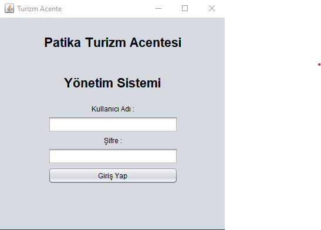
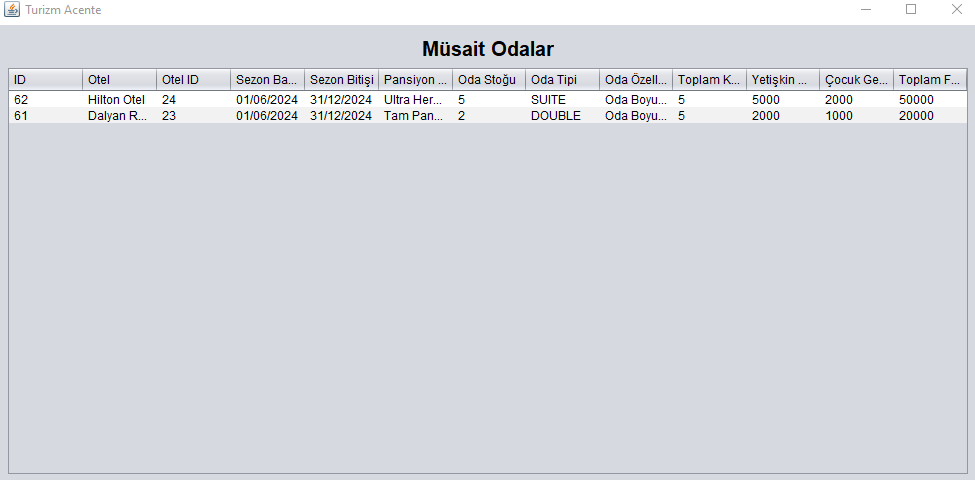
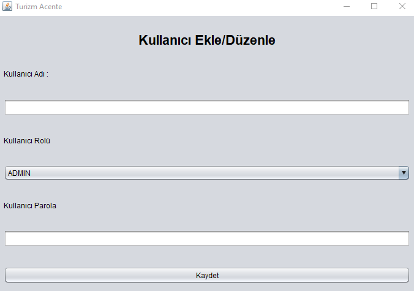
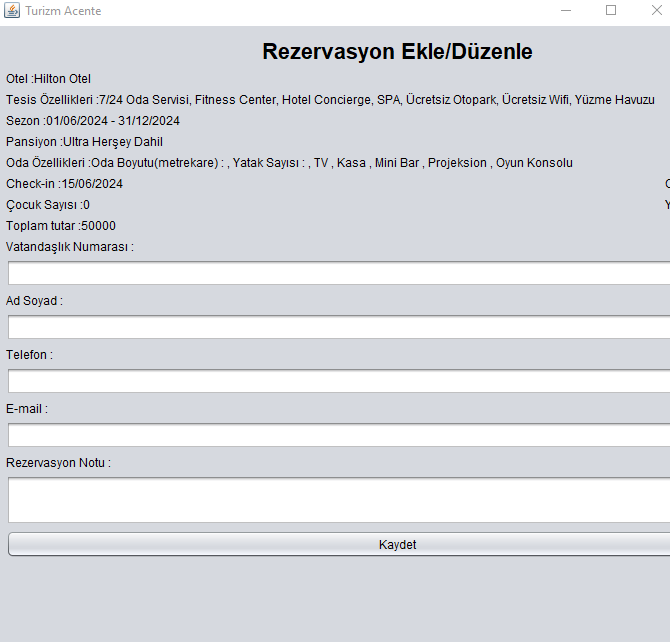
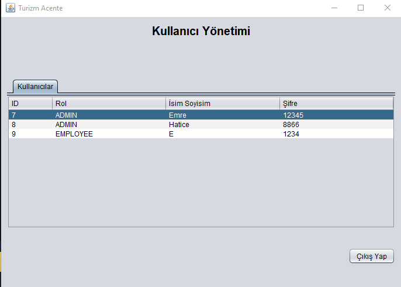
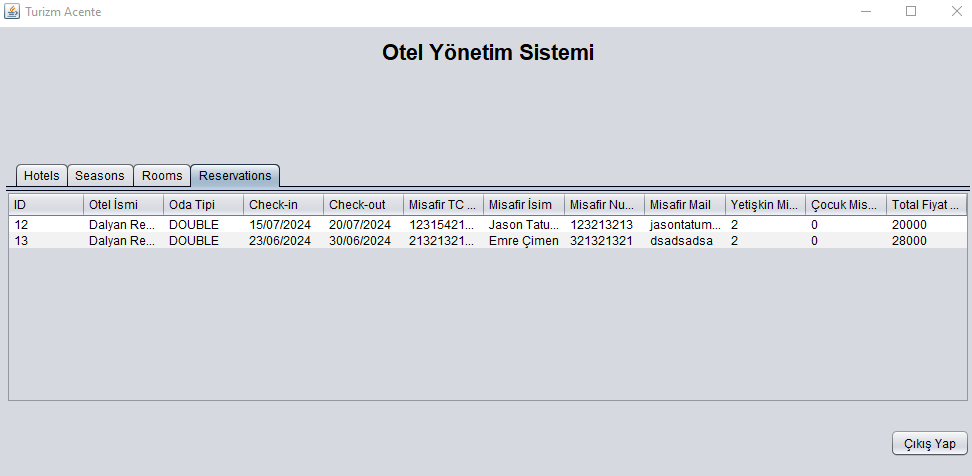
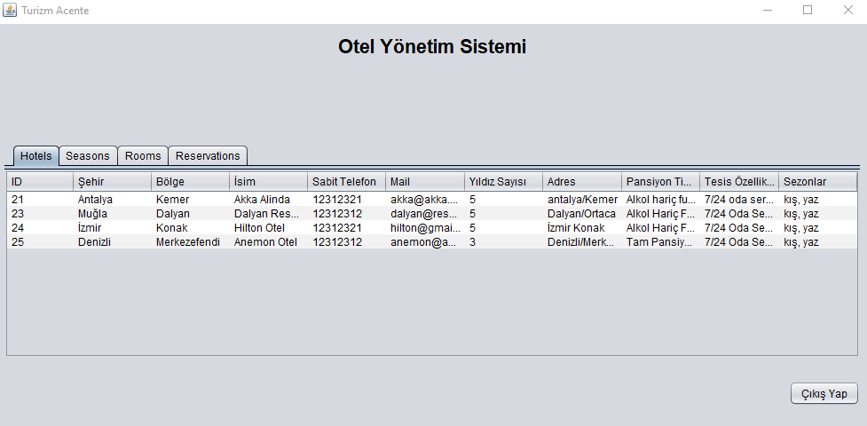
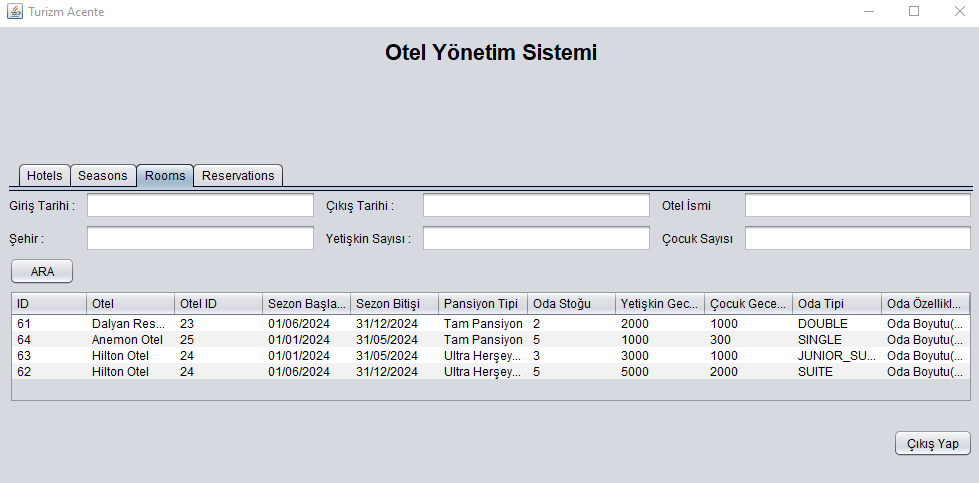

# Tourism Agency System

In this tourism agency system  application basic level hotel management, season management, room management, and reservation processes can be performed.
## Technologies
* Java 
* Swing Framework
* PostgreSQL 
* IntelliJ IDEA 

## Installation

1. Make sure that at least JDK 1.8 is installed on your system.
```bash
java --version
```
2. To clone the project repository, run the following command in the terminal:
```bash
   git clone https://github.com/emrecimen20/Tourism_Agency.git
   ```
3. Follow these steps to import the PostgreSQL backup file located inside the project folder:
    *  Navigate to the project folder in the terminal.
    * Import the PostgreSQL backup file:
   ```bash
   psql -U username -d database_name -f backup_file.sql
   ```
4. Before establishing the database connection, update the username and password.

## Screenshots

 
 
 
 
 
 


------------------------------------------------------------------------------------------------------
